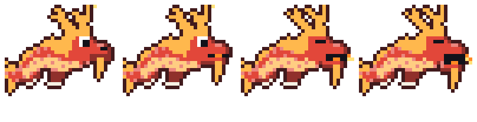

<h1 align="center">Hyperwyrm</h1>

<p align="center">
  A pixel-art eastern dragon that lives in your <a href="https://omarchy.org">Omarchy</a> bar, roams your windows,<br>
  grows through three forms, and is steered by a tiny CfC neural network.
</p>

<p align="center">
  
</p>

<p align="center">
  <a href="docs/media/demo.mp4">Watch the full demo</a>
</p>

---

## Features

- **Lives on your screen.** Out of the bar it walks along window tops, jumps, falls and (once grown) flies over your applications. Only the dragon and its mess catch mouse clicks; everything else passes straight through.
- **Three forms.** Feed and play with it and it grows from Wyrmling to Wyvern to Emperor Dragon, with a light-burst-and-confetti cutscene at each step. The bar icon changes with it.
- **Real needs.** Fullness, happiness and energy drain over time. It gets hungry, sleepy and playful, and tells you so.
- **Talks about what you are doing.** Its speech reacts to the window you have focused (terminal, browser, editor and so on) and to its own mood.
- **Bond.** Every kind thing you do builds bond, which slows how fast it gets unhappy.
- **A sulking mode.** Neglect it and a storm cloud follows it around, its colours fade, it refuses a first snack, huffs steam and stomps off to the edge of the screen.
- **Mess to clean up.** It poops after eating. Leave it for 30 seconds and it stresses out.
- **Happy tricks.** A cheerful dragon glows with sparkles and hearts, dances, spins, does zoomies and loop-the-loops, and leaves gifts on the floor.
- **Badges.** Fourteen collectable gems, shown at the top right of its home menu.
- **Tag.** An optional 20-second mini-game where the neural network runs from your cursor.
- **Seven colours.** Red, blue, green, gold, purple, silver and black.

## The forms

<p align="center">
  
</p>

| Form | XP | What it is |
| --- | --- | --- |
| **Egg** | 0 | Pick a colour and hatch it: a big egg wobbles, cracks and bursts open, then you name the wyrmling. |
| **Wyrmling** | 0 | A small, snake-like serpent that slithers along the ground and window tops. |
| **Wyvern** | 100 | Grows horns and a beard, and takes to the air. |
| **Emperor Dragon** | 300 | A branched antler crown, a golden belly band and a crest. Breathes fire when it is completely fed, rested and happy. |

Growth comes from feeding and playing. Passive growth is capped just below the next threshold, so evolving is always something you did.

<p align="center">
  <br>
  <sub>Seven colours</sub>
</p>

<p align="center">
  <br>
  <sub>Emperor Dragon fire animation</sub>
</p>

## Install

Hyperwyrm is an Omarchy shell plugin (service and bar widget).

```bash
omarchy plugin add <git-url-of-this-repo> --enable
omarchy restart shell
```

Then add the **Hyperwyrm** widget to your bar if it was not placed automatically (`omarchy bar` has the commands). Click the icon to open its home, pick a colour and hatch the egg.

Requires Omarchy with the plugin-capable shell (Quickshell) and Hyprland.

## Caring for your dragon

**Food.** Open the home menu and drag a snack out onto the screen. It falls, the dragon walks over and eats it. Snacks it cannot eat yet stay put until you click them away.

| Snack | Fullness | Happiness |
| --- | --- | --- |
| Apple | +15 | +4 |
| Cookie | +10 | +10 |
| Fish | +25 | +6 |
| Meat | +30 | +5 |
| Cake | +20 | +14 |

<p align="center"></p>

**Rest.** It walks to its favourite spot, curls up and sleeps for about a minute (Zzz included).

**Play.** For 30 to 45 seconds it chases your mouse cursor like a kitten after a laser dot.

**Tag.** Occasionally it asks for a game, or press *Tag*. Click it four times in 20 seconds while it dashes away. Winning earns the Tag Champion badge.

**Poop.** A snack is digested one to three minutes later. Click the mess to clean it up; left for more than 30 seconds it costs happiness. It happens even while the dragon is put away.

**Moods.** *Happy, hungry, sleepy, playful,* or *unhappy*. Below 35% happiness it turns unhappy and stays that way until it climbs back over 50%. You can still put an unhappy dragon away, and poke it if you like (it scoots off).

**Badges.** Eight gift gems, three bond milestones (25, 50, 100), Firebreather, Emperor Form and Tag Champion.

## How the brain works

Its movement is not scripted. A small **CfC** (closed-form continuous-time) network wired with an **NCP** (Neural Circuit Policy, inspired by the *C. elegans* nervous system) turns its state into motion every tenth of a second.

| | |
| --- | --- |
| Model | `ncps` `AutoNCP`, 108 neurons, about 38k trainable parameters |
| Inputs (15) | hunger, tiredness, happiness, time of day (sin, cos), recent window-switching, direction and distance to the focused window, wall proximity (x, y), being petted, two noise channels, tag-game flag |
| Outputs (4) | horizontal velocity, vertical velocity, a rest gate, a jump gate |
| Runtime | a pure-JavaScript forward pass inside QML; no Python, no GPU, no daemon |

The network is trained offline by distilling a hand-written teacher policy (see [`tools/brain`](tools/brain)). Its own outputs decide *when* the dragon stops to rest and when it feels like a trick. In the tag game the same network runs away from your cursor.

### Cost

Designed to be close to free.

- The roaming overlay draws at 30 fps only while the dragon is moving, at 10 fps while it sits, and once a second while it sleeps.
- The brain step takes about 2 ms and runs at 10 Hz, only while it is roaming and awake.
- Needs update on a single 60-second timer; the shell reads the Hyprland event stream only for the active window's class.
- Sprites are pre-rendered 32x32 pixel-art frames. Nothing is computed while drawing them.

## Project layout

```
manifest.json     plugin manifest
src/              the plugin (QML and JS)
  Service.qml     game state: needs, growth, mood, badges, persistence
  RoamWindow.qml  the full-screen click-through overlay: movement, food, tricks, tag
  Panel.qml       the bar icon and home menu
  HatchScene.qml, EvolveScene.qml, Confetti.qml   the cutscenes
  Brain.js, BrainWeights.js                       the CfC forward pass and trained weights
  Sprites.js, Foods.js, Phrases.js, Badges.js     art, food data, dialogue, badges
docs/             screenshots, art sheets and the demo video
tools/brain/      train and export the network
tools/docs/       regenerate the art sheets in docs/art
tools/demo/       shell shortcuts for recording demos (XP, badges, gifts, mood)
```

Your dragon is saved to `~/.local/state/omarchy/hyperwyrm.json`.

## Development

Plugin code under `~/.config/omarchy/plugins/` hot-reloads on save for simple edits; run `omarchy restart shell` to be sure after larger changes. To work on a clone, symlink or copy it to `~/.config/omarchy/plugins/dawestheperson.hyperwyrm`.

```bash
omarchy plugin validate .                     # check the manifest
python tools/docs/render_art.py               # rebuild docs/art (needs Node and Pillow)
```

Retraining the brain is described in [`tools/brain/README.md`](tools/brain/README.md).

## Contributing

Ideas, sprites, phrases and tricks are welcome. See [CONTRIBUTING.md](CONTRIBUTING.md).

## Credits

- CfC networks: Hasani et al., *Closed-form continuous-time neural networks*, Nature Machine Intelligence, 2022.
- [`ncps`](https://github.com/mlech26l/ncps) by Mathias Lechner, used for training.
- Built for [Omarchy](https://omarchy.org).

## License

[MIT](LICENSE)
